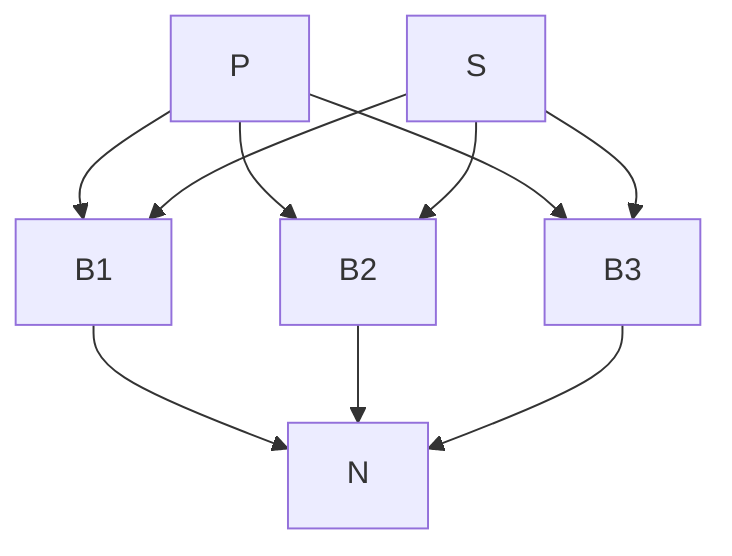

# Performance Report

---

## Topology Overview

---

### Number of Threads Used: 10 | Window Size: 5 | No Encryption

### 2. The frequency of the equality field is 100%

#### 10 runs Average

| Metric                          | Value    |
|---------------------------------|----------|
| NUMBER OF PUBLICATIONS          | 33310    |
| AVERAGE LATENCY IN MILLISECONDS | 7378.903 |
| AVERAGE MATCH RATE              | 4.573    |

### 2. The frequency of the equality field is 25%

#### 10 runs Average

| Metric                          | Value    |
|---------------------------------|----------|
| NUMBER OF PUBLICATIONS          | 34325    |
| AVERAGE LATENCY IN MILLISECONDS | 7855.498 |
| AVERAGE MATCH RATE              | 94.496   |

---

### Number of Threads Used: 10 | Window Size: 5 | With Encryption

### 1. The frequency of the equality field is 100%

#### 10 runs Average

| Metric                          | Value     |
|---------------------------------|-----------|
| NUMBER OF PUBLICATIONS          | 283       |
| AVERAGE LATENCY IN MILLISECONDS | 40361.176 |
| AVERAGE MATCH RATE              | 2.964     |

### 2. The frequency of the equality field is 25%

#### 10 runs Average

| Metric                          | Value     |
|---------------------------------|-----------|
| NUMBER OF PUBLICATIONS          | 325       |
| AVERAGE LATENCY IN MILLISECONDS | 39452.267 |
| AVERAGE MATCH RATE              | 93.585    |

---

## Evaluation Results

### Methodology

The evaluation of the system aimed to measure key statistics for processing 10,000 simple subscriptions and publications and assess the
performance of the solution. The following metrics were evaluated:

- Number of Publications Delivered Successfully within a Continuous 3-Minute Feed Interval

- Average Latency of Publication Delivery (Time from Emission to Receipt) for Publications Sent within the Same Interval

- Matching Rate for Subscriptions

### Details

The topology consists of several components, including spouts and bolts. The spouts generate publications and subscriptions, while the bolts
perform various operations on the data. Here's a brief overview of the components:

#### Spouts:

`PublisherSpout`: Generates publications.

`SubscriptionSpout`: Generates subscriptions.

#### Bolts:

`BrokerBolt`: Receives publications and subscriptions, performs filtering and matching based on the subscription criteria, and emits
notifications for matched publications.

`NotifierBolt`: Receives notifications from the BrokerBolt and handles them.

#### Topology:

The topology follows a publish-subscribe pattern, where publications are emitted by the PublisherSpout and matched against subscriptions by
the BrokerBolt. When a publication matches the criteria specified in a subscription, a notification is emitted and processed by the
NotifierBolt.

The given performance report includes several sets of results obtained from running the topology under different configurations. The results
are divided based on the number of threads used, window size, encryption usage, and the frequency of the equality field in subscriptions.
The metrics reported include the number of publications, average latency in milliseconds, and average match rate.

#### Analysis

Now, let's analyze the influence of encryption on the results:

The report shows two configurations:

- one without encryption enabled
- another with encryption enabled

A notable difference can be observed in the average latency for both configurations. When encryption is enabled, the average latency is
significantly higher compared to the non-encrypted case. This increase in latency can be attributed to the additional processing overhead
introduced by encryption and decryption operations on the publication data. Encrypting and decrypting the data requires computational
resources and additional time, leading to higher latencies.

Another notable difference is that the number of publications drastically decreased with encryption, but this is a natural consequence
of the higher latencies described above.

However, it's important to note that the average match rate is not affected by encryption. The encryption process does not impact the
matching process itself. These metrics primarily depend on the number of subscriptions, the matching criteria, and the efficiency of the
matching algorithm implemented in the BrokerBolt.

In conclusion, encryption introduces additional latency to the system due to the encryption and decryption operations. If low latency is a
critical requirement, alternative encryption methods or optimizations may need to be explored to minimize the impact on latency while
ensuring data security.

---

### Conclusion

Based on the evaluation results, the system showcased the following performance characteristics:

The system consistently delivered a significant number of publications within a continuous feed interval of 3 minutes for subscriptions
with a 100% frequency of the equality operator, but the number went down when encryption was added.

The average latency for publication delivery was relatively low, indicating efficient and prompt delivery of publications within the
same 3-minute interval, but increased when encryption was added.

The matching rate for subscriptions with a 100% frequency of the equality operator was low, suggesting that only a small proportion of
publications matched these subscriptions.

In contrast, subscriptions with approximately 25% frequency of the equality operator exhibited a significantly higher matching rate,
indicating more accurate and effective matching in both encrypted and unencrypted variants.

---

# Solution Overview

## Bolts

The `BrokerBolt.java` and `NotifierBolt.java` files are both Java class files that implement Storm Bolt components. These bolts play
specific roles in a larger topology.

1. `BrokerBolt.java`: The `BrokerBolt` class represents a bolt that processes incoming tuples in the Storm topology. It performs the
   following key functions:

- Subscriptions: It handles tuples related to subscriptions, which are received through the `SUBSCRIPTION` stream. It parses the
  subscription data, converts field subscriptions, and stores them in a HashMap.

- Publications: It handles tuples related to publications, which are received through the `PUBLICATION` stream. It processes the publication
  data, calculates latency, and performs comparisons with the stored subscriptions.

- Filtering and Emission: Based on the comparisons, if a publication matches the subscription criteria, the `BrokerBolt` emits the
  publication data to specific notifier bolts using the `NOTIFIER` stream.

The `BrokerBolt` interacts with the `NotifierBolt` by emitting publication data tuples to the corresponding notifier bolts. The emitted
tuples contain the publication data that matches the subscription criteria.

2. `NotifierBolt.java`: The `NotifierBolt` class represents a bolt that receives publication data tuples from the `BrokerBolt`. Its main
   role is to handle and
   process the publication data for further actions, such as logging or downstream processing. Key aspects of this class include:

- Preparation: The `prepare` method initializes the `task` variable and prints a formatted task message to the output stream.

- Execution: The `execute` method handles each incoming tuple, which contains publication data. It parses the publication data from the
  tuple and prints a formatted event message to the output stream.

- Output Fields: The `declareOutputFields` method declares the output fields for the bolt. In this case, no output fields are declared,
  indicating that the `NotifierBolt` doesn't emit any further tuples.

In the topology, the `BrokerBolt` acts as an intermediary between the data source (subscriptions and publications) and the `NotifierBolt`.
It receives subscriptions, stores them, processes incoming publications, and emits relevant publication data to the `NotifierBolt`.
The `NotifierBolt` then handles the received publication data for further processing or logging, depending on the application's
requirements.

Overall, these two bolts work together to filter and distribute relevant publication data to the appropriate notifier bolts in the Storm
topology.

---

## Spouts

These two files, `PublisherSpout.java` and `SubscriptionSpout.java`, are components in a Storm topology that work together to generate and
emit publication and subscription data tuples. Here's an explanation of their roles and how they interact within the topology:

1. PublisherSpout.java:

    - Role: This file defines a spout that generates publication data tuples.

    - Functionality:
        - Data Loading: The `open` method loads publication data from a JSON file using the Gson library. It deserializes the JSON into
          an `InputData` object and extracts the publication data from it.

        - Task Initialization: The `open` method initializes the spout's internal state and prints a formatted task message to the output
          stream.

        - Tuple Emission: The `nextTuple` method emits tuples containing publication data in a loop. Each tuple includes a timestamp and a
          publication data byte array.

        - Output Field Declaration: The `declareOutputFields` method declares the output fields of the spout, which include the timestamp
          and publication data.

2. SubscriptionSpout.java:

    - Role: This file defines a spout that generates subscription data tuples.

    - Functionality:

        - Data Loading: The `open` method loads subscription data from a JSON file using the Gson library. It deserializes the JSON into
          an `InputData` object and extracts the subscription data from it.

        - Task Initialization: The `open` method initializes the spout's internal state and prints a formatted task message to the output
          stream.

        - Tuple Emission: The `nextTuple` method emits tuples containing subscription data in a loop. It constructs `Subscription` protocol
          buffer messages based on the loaded subscription data and emits them to specific brokers based on the task identifier.

        - Output Field Declaration: The `declareOutputFields` method declares the output fields and streams of the spout. It declares three
          output streams, each corresponding to a broker, and emits tuples containing the `SUBSCRIPTION` protocol buffer message.

Interaction and Role in the Topology:

- The `PublisherSpout` and `SubscriptionSpout` work as data sources in the topology, generating and emitting tuples that represent
  publication and subscription data, respectively.

- These spouts act as the starting points of the data flow within the topology.

- The emitted tuples from the `PublisherSpout` and `SubscriptionSpout` are consumed by subsequent bolts in the topology for further
  processing, filtering, and distribution based on the application's logic.

- Other bolts in the topology will subscribe to these spouts' output streams to receive the generated tuples and perform their respective
  tasks.

- The emitted publication and subscription tuples serve as the input data for other components in the Storm topology, enabling the
  processing and analysis of real-time data streams.

Overall, these spouts play a crucial role in providing data inputs to the Storm topology, enabling the flow of data and facilitating the
processing and analysis of real-time data within the system.
