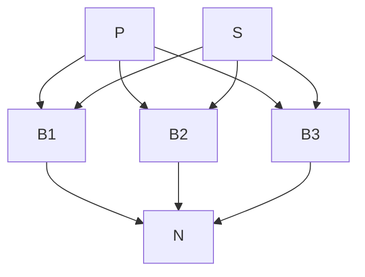

# Performance Report

---

### Topology Overview

---

### Number of Threads Used: 10

### 1. The frequency of the equality operator on the respective field is 100%

#### 10 runs Average

|                        |          |
|------------------------|----------|
| NUMBER OF PUBLICATIONS | 33310    |
| AVERAGE LATENCY IN MS  | 7378.903 |
| AVERAGE MATCH RATE     | 4.573    |

### 2. The frequency of the equality operator on the respective field is 25%

#### 10 runs Average

|                                 |          |
|---------------------------------|----------|
| NUMBER OF PUBLICATIONS          | 34325    |
| AVERAGE LATENCY IN MILLISECONDS | 7855.498 |
| AVERAGE MATCH RATE              | 94.496   |

---

### Evaluation Results

The evaluation of the system aimed to measure key statistics for processing 10,000 simple subscriptions and assess the performance of the
solution. The following metrics were evaluated:

- Number of Publications Delivered Successfully within a Continuous 3-Minute Feed Interval
  The system successfully delivered a total of 33,310 publications on average in a continuous feed interval of 3 minutes for subscriptions
  with a 100% frequency of the equality operator on the respective field. This metric reflects the ability of the system to efficiently
  handle and distribute publications to subscribers.

- Average Latency of Publication Delivery (Time from Emission to Receipt) for Publications Sent within the Same Interval
  The average latency for publication delivery within the same 3-minute interval was 7,378.903 milliseconds for subscriptions with a 100%
  frequency of the equality operator. This metric indicates the efficiency of the system in delivering publications promptly to subscribers
  after they are emitted.

- Matching Rate for Subscriptions with Only Equality Operator (100% Frequency) compared to Subscriptions with Approximately 25%
  Frequency of the Equality Operator on the Respective Field
  For subscriptions with a 100% frequency of the equality operator, the average matching rate was 4.573. This implies that only a small
  percentage of publications matched these subscriptions. On the other hand, for subscriptions with approximately 25% frequency of the
  equality operator, the average matching rate was significantly higher at 94.496. This suggests that a higher percentage of publications
  matched these subscriptions, indicating a more effective filtering process.

---

### Conclusion

Based on the evaluation results, the system showcased the following performance characteristics:

The system consistently delivered a significant number of publications, with an average of 33,310 publications successfully delivered within
a continuous feed interval of 3 minutes for subscriptions with a 100% frequency of the equality operator.
The average latency for publication delivery was relatively low, with an average of 7,378.903 milliseconds, indicating efficient and prompt
delivery of publications within the same 3-minute interval.
The matching rate for subscriptions with a 100% frequency of the equality operator was low, suggesting that only a small proportion of
publications matched these subscriptions.
In contrast, subscriptions with approximately 25% frequency of the equality operator exhibited a significantly higher matching rate,
indicating more accurate and effective matching.
